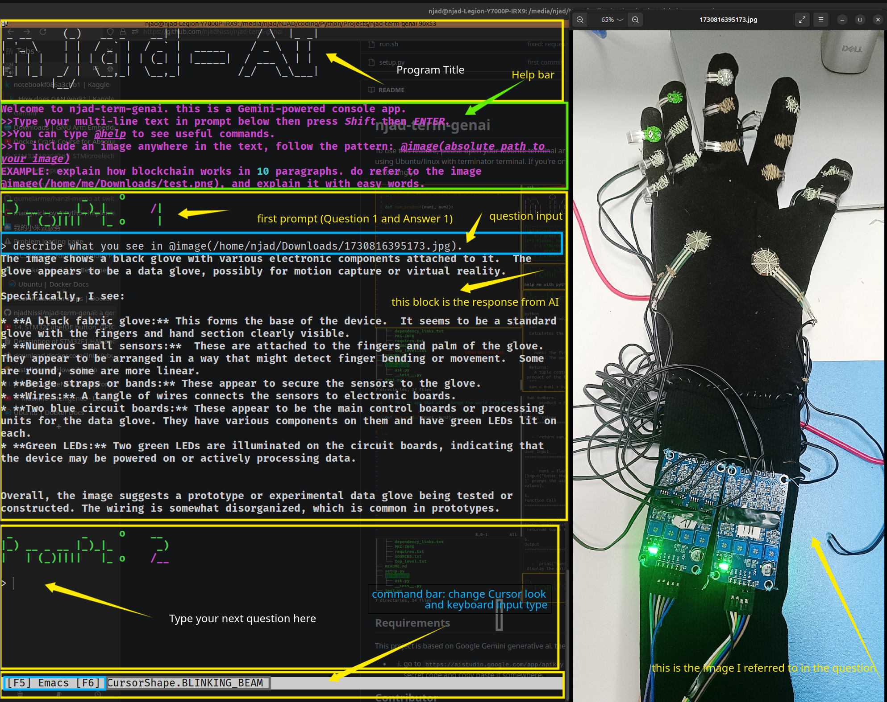

# njad-term-genai

This is a Text User Interface(TUI) for Gemini (Google Large Language Model). 
It allows you to conduct conversations with AI from your terminal window. you can ask questions and include images within the question, help with writing and debugging codes for developpers, etc. It also allows:
- Choosing what model you want to use
- Choosing wich question and answer (part of chat history) to store locally in txt file (you can view on offline mode)

## INSTALLATION

To use this feature, please open your favorite terminal and follow the following steps(as an Example, I am using Ubuntu(linux) with terminator terminal(any would work). If you're on a different environment like MAC or Windows, please modify commands accordingly: 

This project is based on Google Gemini generative ai. the requirement is:

* 1. go to `https://aistudio.google.com/app/apikey` and get yourself a google gemini free developper secret code and copy paste it somewhere.

* 2. Clone the repo "git clone git@github.com:njadNissi/njad-term-genai.git". feel free to create your branch and push your changes and contribution.
* 3. Open the `setup_and_run.sh` file inside the project folder and fill in your infos:
        - 1. BASE_DIR_PATH: this is the asbolute path to the project folder, i.e. Use `/home/$USER/Downloads/njad-term-genai` if it downloaded the project inside the Downloads default folder. change it accordingly.
        - 2. GOOGLE_API_KEY: this is the secret key you received from google. It is recommended to set it in `.bashrc` or `.profile`. but if you prefer not to that, set it here.
        - 3. http_proxy and https_proxy Proxy if needed to access google from your location. some countries do not allow direct connection to google, so if you're using a `network proxy` or `vpn` set it here, if not comment these two lines (by putting a `#` in front).

* 4. If you are using conda, the next step is to open the file `environment.yml`, move to the last line and change the word `njad` in `prefix: /home/njad/anaconda3/envs/genaiterm_env` by your system's user name (you can type `cat $USER` on your terminal to check if you are not sure).

* 5. Finally, execute `./setup_and_run.sh` on your terminal to set the environment. The rest of the job is done automatically (including virtual environment creation in conda or virtualenv and the activation and deactivation). the setup is done only the first time, next time it runs without going through installation process.
**NOTE: IF YOU CREATE THE VIRTUAL ENVIRONMENT MANUALLY, DO INSTALL THE DEPENDENCIES LISTED IN THE `requirements.txt`**

### EXTRA:
if you want to be able to access the program anywhere in your terminal by typing an alias, i.e. `ask`, follow the steps below:
- 1. open the `~/.bash_aliases` file in any text editor.
- 2. add this line: `ask="<full path to project folder>/setup_and_run.sh"` at the bottom of the file. save and close the file. replace `<full path to project folder>` with the actual absolute path where the project is located on your machine.
- 3. close and reopen the bash terminal. to verify, just type your alias, for i.e. `ask` in this example and it will launch the program.

## Future work: Create pip package
* 1. "pip install njad-term-genai"

* reopen the terminal and type `ask`, you'll see the app lauch on your terminal.  enjoy!

